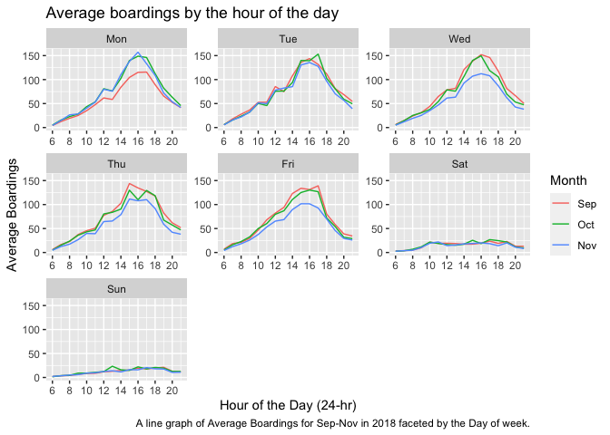
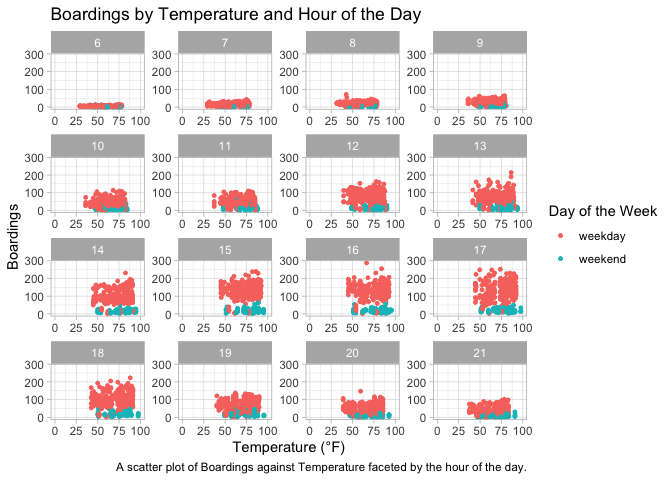
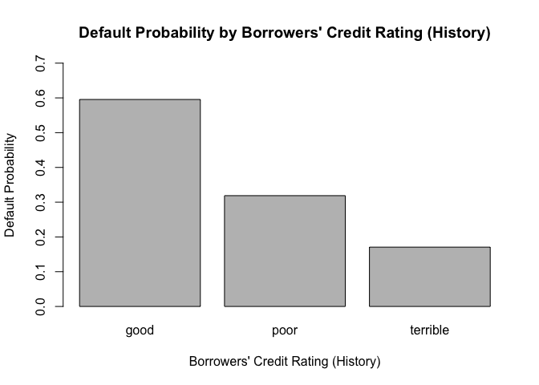
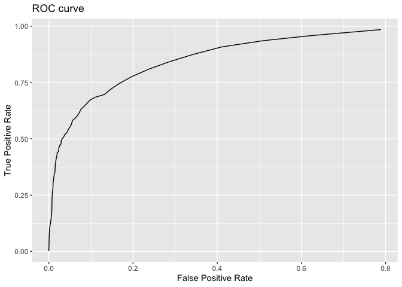
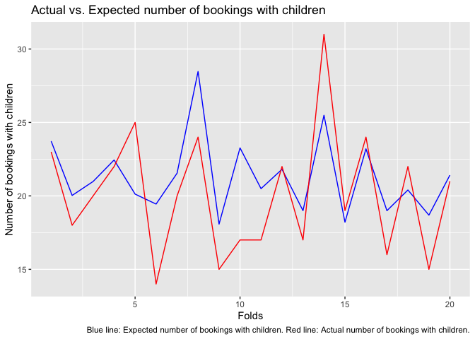

Problem 1: Visualization
------------------------

### Part 1: Average Boardings

Figure 1 shows Average Boardings by the Hour of the Day for each of the
three months: September, October, and November, faceted by the Day of
the week. At a first glance, it can be seen that the Average Boardings
are considerably lower and flatter for the weekend (Sat-Sun) as compared
to the weekdays (Mon\_Fri), which peak between 14:00-16:30 for most
weekdays for all months. This could be attributed to campus classes
being held on the weekdays and not on the weekend. Furthermore, the
number of students and faculty boarding the bus peaks between
14:00-16:30 on weekdays, because typically that is when the work day
ends for faculty and classes end for students. The lower average
boardings on Mondays in September could be attributed to the holiday
observed on Labor Day which is always the first Monday of September. The
absences on Labor Day could be lowering the average baordings on Mondays
for the whole month. Similarly, the lower average boardings on
Wednesday, Thursday, and Friday in November could be a result of the
Thanksgiving break which usually falls on these weekdays, thus the break
lowers the average for these weekdays in November.

### Part 2: Boardings vs. Temperature

Figure 2 displays a panel of scatter plots showing Boardings
vs. Temperature (°F) in each 15-minute window, faceted by hour of the
day (24-hr) with points sorted by weekday or weekend. Holding hour of
the day and weekend status constant, temperature does not appear to have
any noticeable effects on the average number of UT students riding the
bus since the data point remain fairly constant with changes in
temperature.

Problem 2: Linear model vs KNN
------------------------------

The linear model chosen to compete against the knn models includes the
features lotSize, livingArea, bedrooms, age, landValue, bathrooms,
heating, fuel, centralAir and the interactions: (lotSize^2) \* bedrooms
+ (livingArea^2) \* rooms \* bedrooms + (age^2) \* landValue. This model
outperformed the medium model which included all features except for
pctCollege, sewer, waterfront, landValue, and newConstruction.

The cross validated RMSE for the knn model with the same features as the
chosen linear model was much higher than that of the chosen linear
model, thus, the chosen linear model outperformed the knn model. It is
possible that the data points could not be clustered together because
all of the features are important in predicting the housing price. This
is plausibly why the knn model performed poorly and had difficulty
creating distinguishable clusters.

Although the perforance of the linear model is relatively better than
that of the knn model, it is not great in absolute terms based on the
adjusted R-squared which reflects that, approximately only 61% of the
variation in the prices is described by the features in the model.
Despite that, the tax authority should include the features specified in
the chosen linear model as they seem to give the lowest RMSE among the
models observed.

Problem 3
---------

### Bar plot of Default probability

    ##      [,1]
    ## [1,]  0.7
    ## [2,]  1.9
    ## [3,]  3.1

The bar plot seems to be counter-intuitive, the better the borrowers’
rating, the higher the probability of defaulting. It seems like the data
chosen is not appropriate for predicting reasonable default
probabilities. \#\#\# GLM Coefficients

    ##         (Intercept)            duration              amount         installment 
    ##               -0.71                0.03                0.00                0.22 
    ##                 age         historypoor     historyterrible          purposeedu 
    ##               -0.02               -1.11               -1.88                0.72 
    ## purposegoods/repair       purposenewcar      purposeusedcar       foreigngerman 
    ##                0.10                0.85               -0.80               -1.26

The GLM model reflects the same pattern shown in the bar plot. The
coefficients on historypoor and historyterrible are negative which means
that worse credit ratings decrease the probability of default. Clearly,
that is incorrect. Hence, it can be concluded that the bank’s
retrospective sampling method is unsuitable for predictive modeling as
it introduces bias in the model. The bank should adopt random sampling
to avoid bias. \#\# Problem 4

### Model building

    ## [1] "out-of-sample TPR of baseline1"

    ## [1] 0.2566996

    ## [1] "out-of-sample TPR of baseline2"

    ## [1] 0.6389281

    ## [1] "out-of-sample TPR of baseline3"

    ## [1] 0.6346968

    ## [1] "out-of-sample TPR difference between baseline3 and baseline1"

    ## [1] 0.3779972

    ## [1] "out-of-sample TPR difference between baseline3 and baseline2"

    ## [1] -0.004231312

baseine1 only uses market\_segment, adults, customer\_type, and
is\_repeated\_guest variables as features. baseline2 uses all the
possible predictors except the arrival\_date variable. baseline3 uses
all the possible predictors except the arrival\_date variable and
includes the interaction between adults and average\_daily\_rate.

It can be seen that baseline3 gives the highest out-of-sample True
Positive Rate (TPR) at the probability threshold of 0.13. The
out-of-sample TPR difference between baseline3 and baseline1 reflects
that baseline3 significantly outperforms baseline1. The out-of-sample
TPR difference between baseline3 and baseline2 shows that baseline3
outperforms baseline2 as well, but by a much smaller margin.

### Model Validation: Step 1

To validate the model baseline3, a fresh data set “hotels\_val.csv” will
be utilized to build a ROC curve for all possible probability
thresholds.

The ROC shows that the combinations of high True Positive Rate and low
False Positive Rate lie between the probability thresholds of 0.1 and
0.2. Therefore, the chosen probability threshold of 0.13 is reasonable.

### Model Validation: Step 2

The red line shows the Actual number of bookings with children, whereas
the blue line shows the Expected number of bookings with children
obtained from baseline3. It can be seen that the Expected line (blue) is
roughly following the same pattern as the Actual line (red). However,
there are significant and frequent gaps between the two lines showing
the failure of the model to make accurate predictions.

    ## [1] 7.063993

Nevertheless, the RMSE is dispalyed for the difference in the Actual and
the Expected number of booking with children. The RMSE lies between 3.5
and 4 which is a low number, therefore, the model performance is
adequate.
